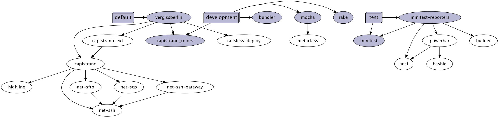

# Vergissberlin

Some hot useles stuff!

## Installation

Add this line to your application's Gemfile:

    gem 'vergissberlin'

And then execute:

    $ bundle

Or install it yourself as:

    $ gem install vergissberlin

## Dependency

## Usage

What ever u want!

## Contributing

1. Fork it
2. Create your feature branch (`git checkout -b my-new-feature`)
3. Commit your changes (`git commit -am 'Add some feature'`)
4. Push to the branch (`git push origin my-new-feature`)
5. Create new Pull Request
